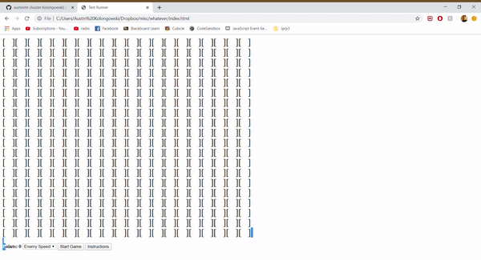

# Text-Runner
I took what you would normally do on a HTML canvas and did it with pure text instead.
The ">" character is the player
The "*" character is a point
The "X" character is an enemy
The "&" character deletes 3 enemies from the map.

